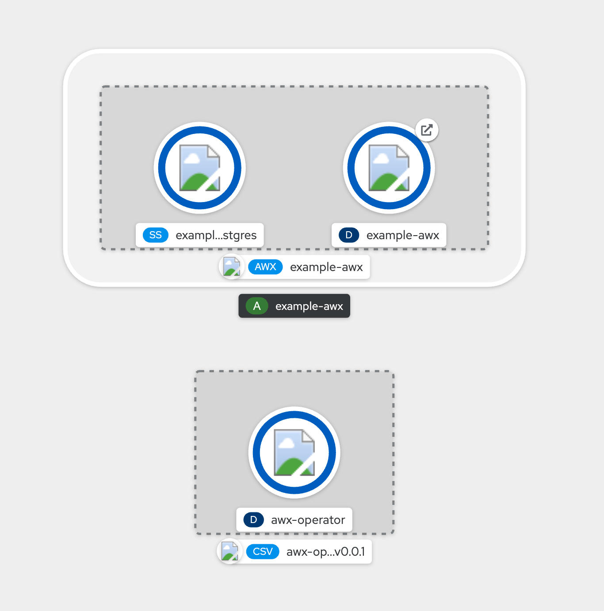

## AWX Operator

This is a repository for making the [AWX upstream Kubernetes Operator](https://github.com/ansible/awx-operator) easily consumable when using Operator Lifecycle Manager. Basically this repo is holding the steps for [generating a bundle](https://github.com/ansible/awx-operator#generating-a-bundle) and adding a nice entry into the OLM catalog sources.

### Just use it!

Create the `CatalogSource` within your OpenShift cluster:

```shell
$ oc create -f awx-operator-catalog-source.yml -n openshift-marketplace  
```

Wait for a yew seconds so that your MarketPlace integrates the new source definition. Now go back to the **OperatorHub** entry and search for `AWX`. You'll see there's a new __Provider Type__ in here:


Install the Operator for all the cluster or within the namespace of your choice.

After installation succeed, you should be able to create new `AWX` custom resource for deploying a new instance. Check [documentation reference](https://github.com/ansible/awx-operator#usage) to setup things. 

> On OpenShift, you'd want to put `tower_ingress_type: route` for having a Route exposed for accessing the instance.


After few minutes, the AWX installation should be up-and-running. You'll see on developer perspective below that a Route is available for accessing the Pod holding the web interface:



You'll now have access to the AWX console, using `admin` username and the password found in a Secret called `<cr-name>-admin-password`. Just login:


Tadam! 😉

### Build it yourself

Of course, you'll have to replace `quay.io/lbroudoux` in different commands and yaml files to suit your own registry/organization.

Build a registry image containing the operator manifests:

```sh
$ docker build -t quay.io/lbroudoux/awx-operator-registry:0.0.1 -f registry.Dockerfile .
Sending build context to Docker daemon  39.42kB
Step 1/10 : FROM quay.io/operator-framework/upstream-registry-builder as builder
 ---> eb1b057fb7de
Step 2/10 : COPY manifests manifests
 ---> 2b8a7446376a
Step 3/10 : RUN ./bin/initializer -o ./bundles.db
 ---> Running in 983c28371c4e
time="2021-04-13T14:54:41Z" level=info msg="loading Bundles" dir=manifests
time="2021-04-13T14:54:41Z" level=info msg=directory dir=manifests file=manifests load=bundles
time="2021-04-13T14:54:41Z" level=info msg=directory dir=manifests file=awx-operator load=bundles
time="2021-04-13T14:54:41Z" level=info msg=directory dir=manifests file=0.0.1 load=bundles
time="2021-04-13T14:54:41Z" level=info msg="found csv, loading bundle" dir=manifests file=awx-operator.v0.0.1.clusterserviceversion.yaml load=bundles
time="2021-04-13T14:54:41Z" level=info msg="loading bundle file" dir=manifests/awx-operator/0.0.1 file=awx-operator.crd.yaml load=bundle name=awx-operator.v0.0.1
time="2021-04-13T14:54:41Z" level=info msg="loading bundle file" dir=manifests/awx-operator/0.0.1 file=awx-operator.v0.0.1.clusterserviceversion.yaml load=bundle name=awx-operator.v0.0.1
time="2021-04-13T14:54:41Z" level=info msg="loading Packages and Entries" dir=manifests
time="2021-04-13T14:54:41Z" level=info msg=directory dir=manifests file=manifests load=package
time="2021-04-13T14:54:41Z" level=info msg=directory dir=manifests file=awx-operator load=package
time="2021-04-13T14:54:41Z" level=info msg=directory dir=manifests file=0.0.1 load=package
Removing intermediate container 983c28371c4e
 ---> 27f11c57ba2c
Step 4/10 : FROM scratch
 ---> 
Step 5/10 : COPY --from=builder /bundles.db /bundles.db
 ---> c920dc3bd439
Step 6/10 : COPY --from=builder /bin/registry-server /registry-server
 ---> 468750d3265f
Step 7/10 : COPY --from=builder /bin/grpc_health_probe /bin/grpc_health_probe
 ---> f6b98ecd0e8c
Step 8/10 : EXPOSE 50051
 ---> Running in 8d5eb2c89992
Removing intermediate container 8d5eb2c89992
 ---> cf9cf007594a
Step 9/10 : ENTRYPOINT ["/registry-server"]
 ---> Running in d7972719ee5f
Removing intermediate container d7972719ee5f
 ---> c9e994b425b0
Step 10/10 : CMD ["--database", "bundles.db"]
 ---> Running in f66b124d8cf7
Removing intermediate container f66b124d8cf7
 ---> 12fb45253059
Successfully built 12fb45253059
Successfully tagged quay.io/lbroudoux/awx-operator-registry:0.0.1
```

Now push it to a central registry:

```shel
$ docker push quay.io/lbroudoux/awx-operator-registry:0.0.1
```

Create the `CatalogSource` within your OpenShift cluster:

```shell
$ oc create -f awx-operator-catalog-source.yml -n openshift-marketplace  
```